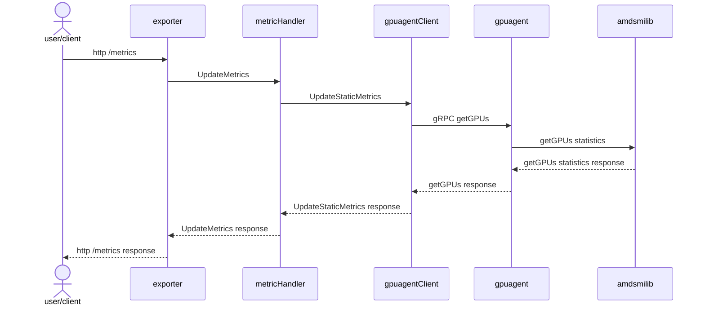
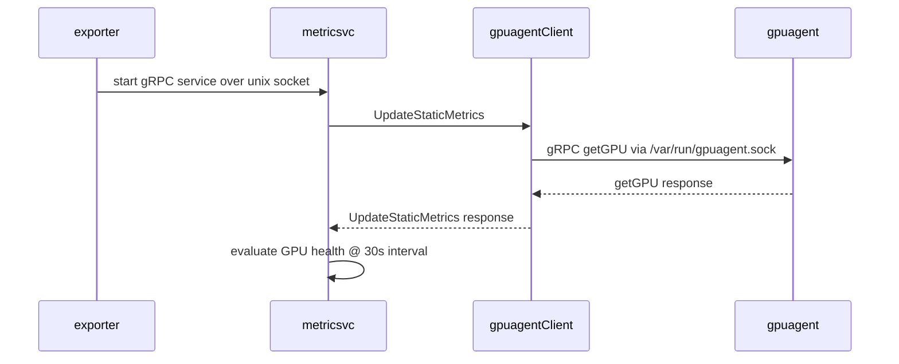
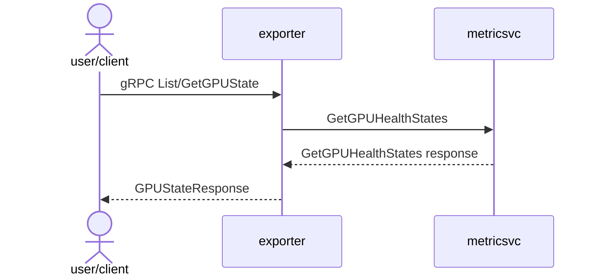

# Developer Guide

This document provides build instructions and guidance for developers working on the AMD Device Metrics Exporter repository.

## Git submodule setup

`libgimsmi` (the GIM SR-IOV SMI library) is the only remaining git submodule
— `gpuagent` and `libamdsmi` are no longer submodules; they are cloned or
staged at build time instead (see [GPU Agent Integration](#gpu-agent-integration)
and [Build AMD SMI](#build-amd-smi)). Make sure to update the submodule on
every pull from the repository.

```bash
git submodule update --init --recursive
```

## Environment Setup

The project Makefile provides a easy way to create a docker build container that packages the Docker and Go versions needed to build this repository. The following environment variables can be set, either directly or via a `dev.env` file:

- `DOCKER_REGISTRY`: Docker registry (default: `docker.io/rocm`).
- `DOCKER_BUILDER_TAG`: Docker build container tag (default: `v1.0`).
- `BUILD_BASE_IMAGE`: Base image for Docker build container (default: `ubuntu:22.04`).
- `EXPORTER_IMAGE_NAME`: Metrics exporter container name (default: `device-metrics-exporter`).
- `EXPORTER_IMAGE_TAG`: Metrics exporter container tag (default: `latest`).
- `TESTRUNNER_IMAGE_NAME`: Test runner image name (default: `test-runner`).
- `UBUNTU_VERSION`: Ubuntu version for builds (`jammy` for 22.04, `noble` for 24.04).

## Build Prerequisites

Before starting, ensure you have Docker installed and running with the user permissions set appropriately.

## Quick Start

To quickly build everything using Docker:

```bash
make default
```

The default target creates a docker build container that packages the developer tools required to build all other targets in the Makefile and builds the `all` target in this build container.

## Building Components

Each component has prebuilt assets committed under `assets/`. If any changes
are made to a respective component, the component needs to be rebuilt
accordingly. `make docker` (or `make pkg`) built after any component rebuild
will pack the newly built assets.

| Component | Directory | Compilation Target |
| ----------------- | ------------------------- | ---------------------------------- |
| amd-smi | $(TOP_DIR)/libamdsmi | `make amdsmi-compile-all` |
| gpuagent | (cloned in-image, not a submodule — see [GPU Agent Integration](#gpu-agent-integration)) | built automatically by `make docker` |
| rocprofilerclient | $(TOP_DIR)/rocprofilerclient | `make rocprofiler-compile` |

### Build and Launch Docker Build Container Shell

Run the following command to start a Docker-based build container shell:

```bash
make docker-shell
```

This gives you an interactive Docker environment with necessary tools pre-installed. It is recommended to run all other Makefile targets in this build environment.

### Compiling the AMD Device Metrics Exporter

To compile from within the build environment, run:

```bash
make all
```

This command builds:

- AMD Metrics Exporter
- Proto-generated code
- Metrics utility
- AMD Test Runner

**Note**: AMD Test Runner builds are currently disabled in this branch. Please use prebuilt images to deploy test runner until support for building the component is added here.

### Building a Debian/RPM Package

To build a Debian ubuntu 22.04, 24.04 and Rhel 9 rpm

#### Build dependent libraries for packaging (once)

```bash
make profiler-libdependent-assets
```

#### Build package with all dependent libraries

```bash
make pkg
```

This will create `.deb` packages in the `bin` directory.

### Build Docker images

Build standard exporter image:

```bash
make docker
```

### Testing

To run unit tests in `pkg/`:

```bash
make unit-test
```

To run end-end tests:

```bash
make e2e
```

**Note**: End-end tests run on mock AMD Metrics Exporter image that mocks the metrics generated.

## Kubernetes E2E Tests

The `test/k8s-e2e/` directory contains a test suite that runs against a live Kubernetes cluster:

| Suite | Tests | What it tests |
| --- | --- | --- |
| **DME standalone** | `Test001`–`Test200` | DME deployed via its own Helm chart |

### Prerequisites

- A running Kubernetes cluster with at least one AMD GPU node
- `kubectl` configured (`~/.kube/config` or a custom kubeconfig)
- Docker (to build the test runner image)
- The DME Helm chart at `helm-charts/` (for DME standalone mode)

### Test runner image

All modes use a containerized test runner built from `test/k8s-e2e/Dockerfile.e2e`. Build it once (or pass `--rebuild` to rebuild automatically):

```bash
docker build -t dme-k8s-e2e:latest -f test/k8s-e2e/Dockerfile.e2e .
```

### Running with run-e2e.sh

`test/k8s-e2e/run-e2e.sh` is the recommended entry point. It builds the image if needed and dispatches to the correct mode.

#### DME standalone tests (Test001–Test200)

Deploys DME via its standalone Helm chart and verifies metrics, health, and label propagation.

```bash
bash test/k8s-e2e/run-e2e.sh --dme \
  --kubeconfig /path/to/kubeconfig \
  --registry rocm/device-metrics-exporter \
  --imagetag v1.5.1
```

### Running with make (inside the build container)

From inside the `test/k8s-e2e/` directory, or via the top-level Makefile with `TOP_DIR` set:

```bash
# DME standalone
make all TOP_DIR=$(pwd) KUBECONFIG=/path/to/kubeconfig \
  DOCKER_REGISTRY=rocm EXPORTER_IMAGE_NAME=device-metrics-exporter EXPORTER_IMAGE_TAG=v1.5.1
```

### Running with go test directly

You can also run tests directly with `go test` from `test/k8s-e2e/`. This requires Go 1.25+ in `$PATH`.

#### DME standalone

```bash
cd test/k8s-e2e
go test -mod=vendor -v -failfast \
  -helmchart ../../helm-charts \
  -registry rocm/device-metrics-exporter \
  -imagetag v1.5.1 \
  -kubeconfig /path/to/kubeconfig \
  -test.timeout 30m
```

### Common flags

| Flag | Default | Description |
| --- | --- | --- |
| `-kubeconfig` | `~/.kube/config` | Path to kubeconfig |
| `-namespace` | `kube-amd-gpu` | Kubernetes namespace |
| `-check.f` | _(all)_ | Regex filter for test names (gocheck syntax) |
| `-test.timeout` | `30m` | Overall test timeout |
| `-helmchart` | _(none)_ | Path to DME standalone Helm chart |
| `-registry` | `docker.io/rocm/device-metrics-exporter` | DME image registry |
| `-imagetag` | `latest` | DME image tag |

### Helm Chart Packaging

To package Helm charts:

```bash
make helm-charts
```

## GPU Agent Integration

The AMD Device Metrics Exporter relies on [GPU Agent](https://github.com/ROCm/gpu-agent.git), which provides programmable APIs to configure and monitor AMD Instinct and Radeon AI GPUs. GPU Agent enables low-level interactions with the GPUs, facilitating the collection and reporting of device-specific metrics.

### Building GPU Agent

GPU Agent is **not** a git submodule. It is cloned at a pinned commit and
compiled from source inside the exporter's multi-stage Docker build
(`docker/Dockerfile.exporter-release`) — there is no standalone host-side
build step. `make docker` (or `make pkg`) handles cloning and compiling GPU
Agent automatically as part of the image/package build.

To advance the pinned GPU Agent commit, update `GPUAGENT_COMMIT` in the
top-level `Makefile` (must be a full 40-character SHA) and re-run `make
docker`.

## Build ROC Profiler Module

set the correct rocm version and run the target to create new libraries
associated with specific rocm version

```bash
ROCM_VERSION=6.4.1 make profiler-libdependent-assets
ROCM_VERSION=6.4.1 make rocprofiler-build
ROCM_VERSION=6.4.1 make rocprofiler-compile
```

## Build AMD SMI

This is built out of [AMD SMI Lib](https://github.com/ROCm/rocm-systems.git)
(`projects/amdsmi` subdirectory), to access the AMD GPU hardware driver.

Each target below builds the builder image (if needed) and compiles for that
OS in one step:

```bash
make amdsmi-compile-rhel
make amdsmi-compile-ub22
make amdsmi-compile-ub24
```

Or build for all supported OSes at once:

```bash
make amdsmi-compile-all
```

## Build Rocprofiler Library

This is exporter library built out of ROCm rocprofiler-sdk to access profiler
metrics.

### Build Container(one time)

```bash
make rocprofiler-build
```

### Compile application rocprofiler library

```bash
make rocprofiler-compile
```

## Architecture

### Metrics HTTP Server Request Handling



### Health Monitoring And gRPC Service



### Health gRPC Request Handling


